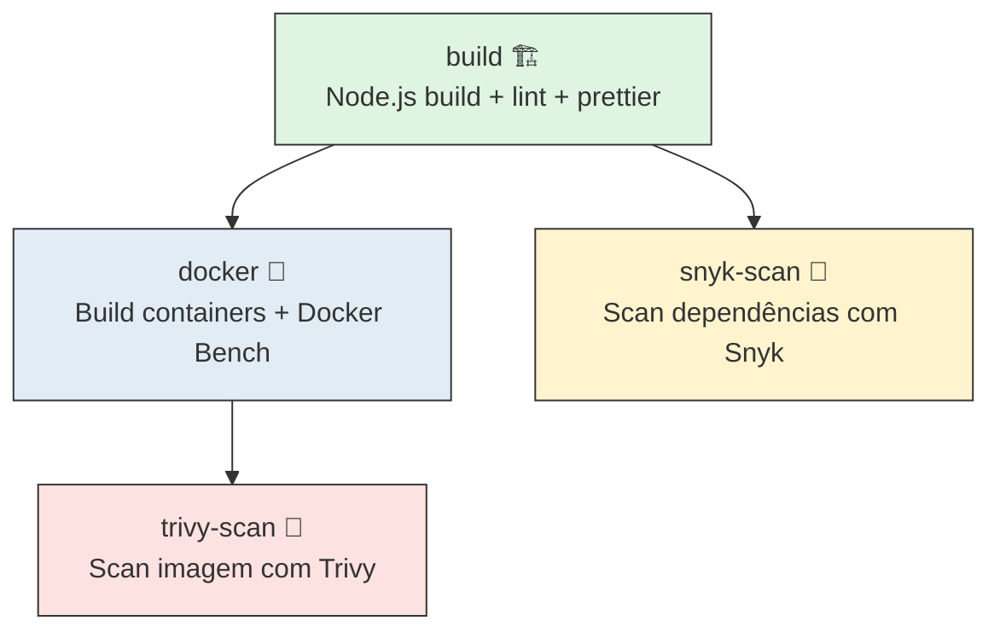

## 🛡 Security Misconfiguration


### 📌 Objetivos

I. Security Misconfiguration  
II. Exemplos de Misconfiguration  
III. Demonstração Prática em Node.js + Express + Docker  
IV. Boas Práticas de Mitigação  
V. Integração de Ferramentas de Segurança no CI/CD  


---

### 🚀 Clonando o Repositório

```bash
git clone https://github.com/arleysouza/security-misconfiguration.git app
cd app
```


---

### ▶️ Subindo a Aplicação com Docker Compose

```bash
docker compose -f docker-compose.yml up --build -d
```

Esse comando:
- Constrói a imagem do servidor (`server-app`) com Node.js e Express  
- Sobe os containers de **PostgreSQL** e **Redis**  
- Cria a rede isolada `minha-network`  
- Inicia a aplicação na porta **3001**  
- Aplica boas práticas de segurança, como:
    - `USER node` no container da aplicação (evitando execução como root).
    - `healthcheck` configurado em Postgres, Redis e App Server.
    - `security_opt: no-new-privileges:true` para restringir privilégios.
    - Limites de CPU e memória nos serviços.

📍 Acesse em: [http://localhost:3001](http://localhost:3001)


---

### ⏹️ Parando os Containers

Para parar e remover os containers:

```bash
docker compose -f docker-compose.yml down
```

Se quiser **remover volumes** também (dados persistidos):

```bash
docker compose down -v
```


---

### 🛠️ Tecnologias Utilizadas

- **Node.js + Express + TypeScript**  
  Backend principal da aplicação, responsável pelas rotas e lógica de negócio.  
  - Express: framework web minimalista.  
  - TypeScript: tipagem estática para maior robustez.  

- **PostgreSQL**  
  Banco de dados relacional utilizado para persistência de informações.  

- **Redis**  
  Utilizado como cache em memória e para filas.  

- **Docker**  
  Ferramenta de containerização que permite rodar todos os serviços de forma isolada.  

- **Docker Compose**  
  Orquestrador que define e gerencia os serviços (Postgres, Redis, App Server).  

- **Docker Bench Security**  
  Ferramenta oficial da Docker Inc. que executa auditorias de segurança nos containers, avaliando configurações e boas práticas. 

- **Trivy**  
  Scanner de vulnerabilidades para imagens Docker e dependências da aplicação, integrada ao pipeline via GitHub Actions.

- **Snyk**  
  Ferramenta de análise de vulnerabilidades em bibliotecas Node.js e containers, integrada ao pipeline via GitHub Actions.


---

### 🧪 Integração no Pipeline (GitHub Actions)

O repositório contém um workflow (`.github/workflows/ci.yml`) que possui quatro jobs:
- **Prettier + ESLint** (`build`): qualidade e estilo do código.
- **Docker Bench Security** (`docker` depende do `build`): auditoria automática da configuração de containers.
- **Trivy** (`trivy-scan` depende do `docker`): scanner de vulnerabilidades, com relatórios em JSON exportados como artefato.
- **Snyk** (`snyk-scan` depende do `build`): verificação de dependências e containers, também exportando relatórios para download.

📌 Para rodar o Snyk no pipeline, é necessário configurar o **SNYK_TOKEN** no repositório:
1. Crie uma conta gratuita em https://snyk.io
2. Acesse **Account Settings > API Token** e copie o token.
3. No GitHub acesse **Settings > Secrets and variables > Actions > New repository secret**.
    - Nome: `SNYK_TOKEN`
    - Valor: cole o token gerado




---

### 🔐 Exercício – Hardening da Aplicação

1. Suba a aplicação com Docker Compose.  
2. Rode o Docker Bench Security:  

```bash
docker run -it --name docker-bench \
  --net host \
  --pid host \
  --userns host \
  --cap-add audit_control \
  -v /var/lib:/var/lib:ro \
  -v /var/run/docker.sock:/var/run/docker.sock:ro \
  docker/docker-bench-security

```

3. Analise o relatório e identifique as vulnerabilidades.
4. Suba a aplicação usando `docker-compose.resposta.yml` para resolver parte dos problemas
encontrados.
5. Reexecute a ferramenta `docker-bench` e compare a melhoria no score.


